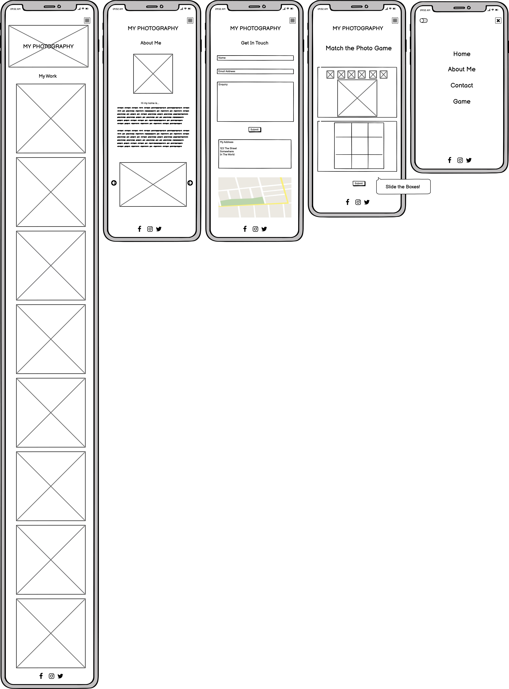
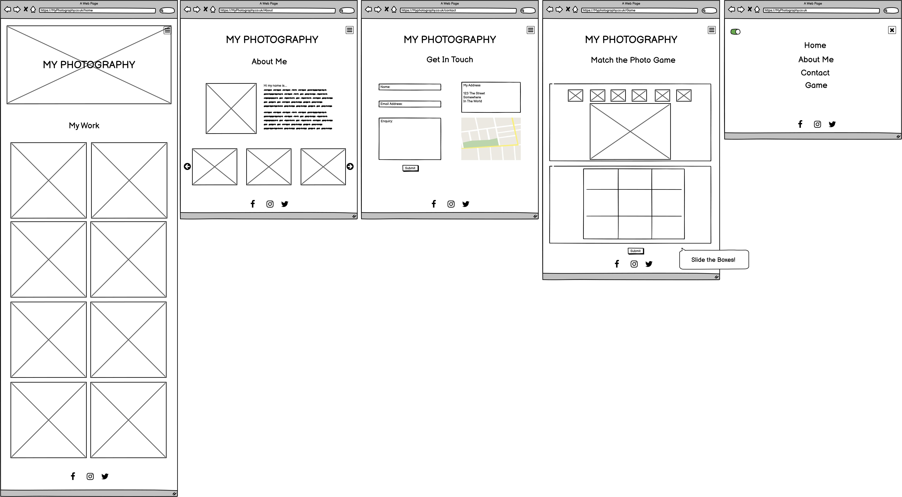

# Fox Photography
(Developer: Benjamin Draper)

 [Live webpage](Insert New Link)

## Table of Content

1. [Project Goals](#project-goals)
    1. [User Goals](#user-goals)
    2. [Site Owner Goals](#site-owner-goals)
2. [User Experience](#user-experience)
    1. [Target Audience](#target-audience)
    2. [User Requirements and Expectations](#user-requrements-and-expectations)
    3. [User Stories](#user-stories)
3. [Design](#design)
    1. [Design Choices](#design-choices)
    2. [Colour](#colours)
    3. [Fonts](#fonts)
    4. [Structure](#structure)
    5. [Wireframes](#wireframes)
4. [Technologies Used](#technologies-used)
    1. [Languages](#languages)
    2. [Frameworks & Tools](#frameworks-&-tools)
5. [Features](#features)
6. [Testing](#validation)
    1. [HTML Validation](#HTML-validation)
    2. [CSS Validation](#CSS-validation)
    3. [Accessibility](#accessibility)
    4. [Performance](#performance)
    5. [Device testing](#performing-tests-on-various-devices)
    6. [Browser compatibility](#browser-compatability)
    7. [Testing user stories](#testing-user-stories)
7. [Bugs](#Bugs)
8. [Deployment](#deployment)
9. [Credits](#credits)
10. [Acknowledgements](#acknowledgements)

## Project Goals 

### User Goals

### Site Owner Goals

## User Experience

### Target Audience

### User Requirements and Expectations

### User Stories
 
#### First-time User 
1. As a first-time user, I would like to be able to navigate through the website easily. 
2. As a first-time user, I would like to be able to contact the company.
3. As a first-time user, I want to see the company’s gallery.
4. As a first-time user, I want to know about the company.
 
#### Returning User
5. As a returning user, I would like to see the company’s portfolio.
6. As a returning user, I would like to be able to find the company.
7. As a returning user, I would like to find out more information about the company. 
 
#### Company Owner 
8. As the company owner, I want users to be able to see the galley with ease.
9. As the company owner, I want users to get to know the website. 
10. As the company owner, I want the users to be able to contact us easily.
11. As the company owner, I want the website to act in a responsive manner on all devices.
12. As the company owner, I want users to get redirected to a custom 404 error page if they type in a wrong link into their browser.

## Design

### Design Choices

### Colour

 

### Fonts
 

### Structure

### Wireframes

Mobile Design

Desktop Design

## Technologies Used

### Languages
- HTML
- CSS
- JavaScript

### Frameworks & Tools
- Git
- GitHub
- Gitpod 
- Balsamiq
- Google Fonts 
- Favicon.io
- coolors
- Am I Responsive?

## Features

## Validation

### HTML Validation

### CSS Validation

### JavaScript Validation

### Accessibility

### Performance

### Performing tests on various devices

### Browser compatibility

### Testing user stories

## Bugs

## Deployment

The website was deployed using GitHub Pages by following these steps:
1. In the GitHub repository navigate to the Settings tab
2. On the left-hand menu select Pages
3. For the source select Branch: master
4. After the webpage refreshes automatically you will see a ribbon on the top saying: "Your site is published at !!!INSERT LINK!!!

You can fork the repository by following these steps:
1. Go to the GitHub repository
2. Click on Fork button in upper right-hand corner

You can clone the repository by following these steps:
1. Go to the GitHub repository 
2. Locate the Code button above the list of files and click it 
3. Select if you prefer to clone using HTTPS, SSH, or Github CLI and click the copy button to copy the URL to your clipboard
4. Open Git Bash
5. Change the current working directory to the one where you want the cloned directory
6. Type git clone and paste the URL from the clipboard ($ git clone https://github.com/YOUR-USERNAME/YOUR-REPOSITORY)
7.Press Enter to create your local clone.

## Credits
Images and Logos not referenced below are owned by the developer.

### Media

### Code

## Acknowledgements