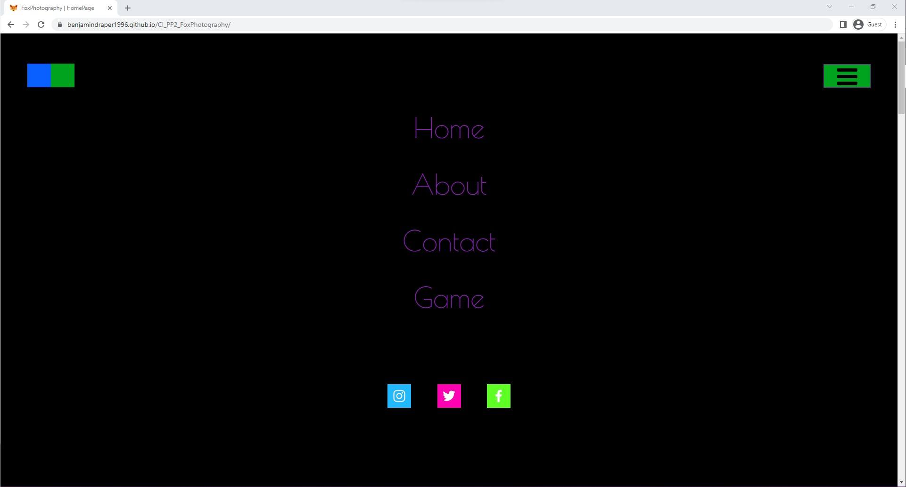
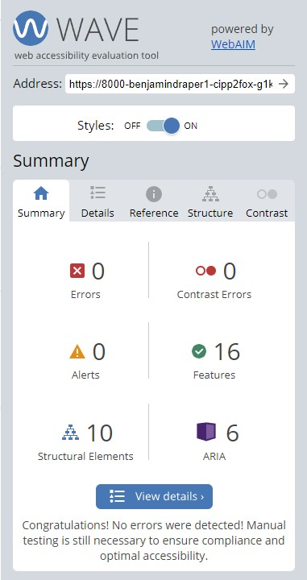
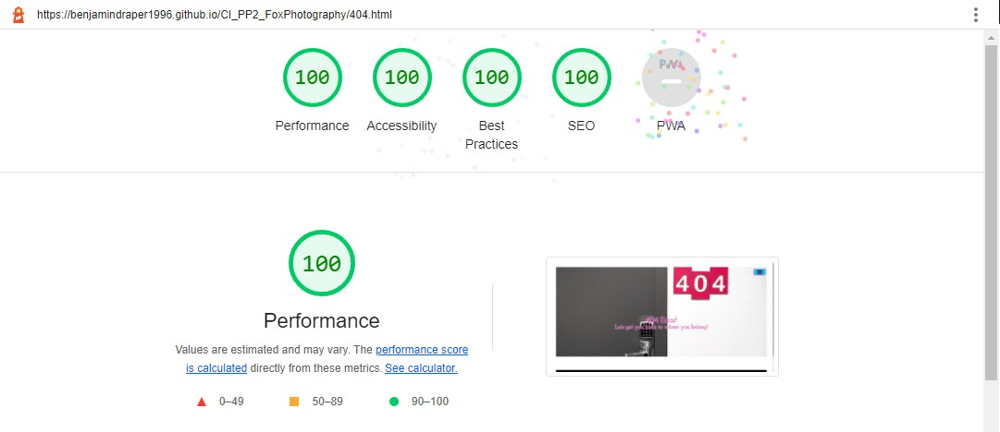
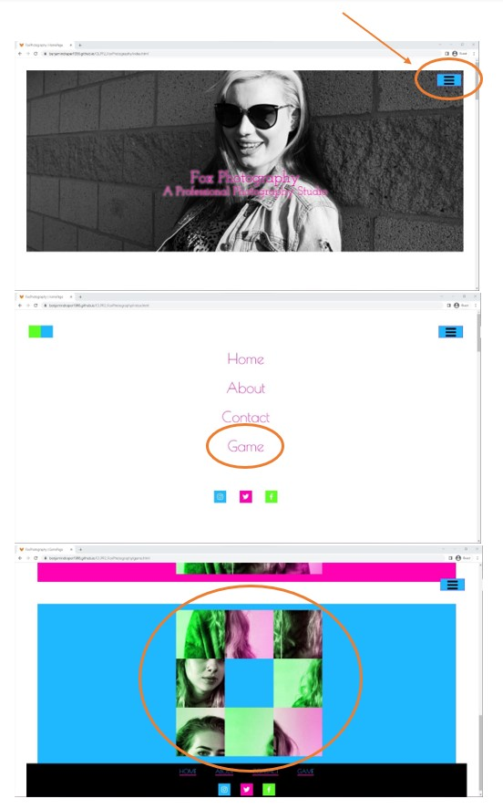

# Fox Photography
(Developer: Benjamin Draper)

 [Live webpage](https://benjamindraper1996.github.io/CI_PP2_FoxPhotography/)

## Table of Content

1. [Project Goals](#project-goals)
    1. [User Goals](#user-goals)
    2. [Site Owner Goals](#site-owner-goals)
2. [User Experience](#user-experience)
    1. [Target Audience](#target-audience)
    2. [User Requirements and Expectations](#user-requirements-and-expectations)
    3. [User Stories](#user-stories)
3. [Design](#design)
    1. [Design Choices](#design-choices)
    2. [Colour](#colour)
    3. [Fonts](#fonts)
    4. [Structure](#structure)
    5. [Wireframes](#wireframes)
4. [Technologies Used](#technologies-used)
    1. [Languages](#languages)
    2. [Frameworks & Tools](#frameworks--tools)
5. [Features](#features)
6. [Testing](#validation)
    1. [HTML Validation](#html-validation)
    2. [CSS Validation](#css-validation)
    3. [JavaScript Validation](#javascript-validation)
    4. [Accessibility](#accessibility)
    5. [Performance](#performance)
    6. [Device testing](#performing-tests-on-various-devices)
    7. [Browser compatibility](#browser-compatibility)
    8. [Testing user stories](#testing-user-stories)
7. [Bugs](#bugs)
8. [Deployment](#deployment)
9. [Credits](#credits)
10. [Acknowledgements](#acknowledgements)

## Project Goals 

### User Goals
- Having a portfolio website to show the clients work off in a eye catching way.
- See a variety of the different types of work the client performs.
- Find information about how to get in contact with the business.
- Find the location on the business.

### Site Owner Goals
- Increase the number of customers through visitors to the website.
- Promote the company to new and existing users.
- Provide a way for customers to contact the business for all queries.
- Provide essential information to anyone who needs it.

## User Experience

### Target Audience
- This business is targeting first time users for bespoke photoshoots.
- This business is targeting groups of individuals who want professional photographs of events.
- This business is targeting other companies who require professional photography for an event.

### User Requirements and Expectations
- The user can expect an Intuitive and accessible navigation system.
- The user can expect easily find relevant information relating to the company and the products.
- The user can expect all links work as expected and functions perform their tasks correctly.
- The user can expect presentation is in line with the company guidelines and the website is visually appealing on all screen sizes.
- The user can expect easy access to contact information.
- The user can expect easy to read Headings to draw attention to the areas of interest to the customer.
- The user can expect accessibility features.

### User Stories
 
#### First-time User 
1. As a first-time user, I would like to be able to navigate through the website easily. 
2. As a first-time user, I would like to be able to contact the company.
3. As a first-time user, I want to see the company’s gallery.
4. As a first-time user, I want to know about the company.
5. As a first-time user, I Want to know how to find the business on social media.
 
#### Returning User
6. As a returning user, I would like to see the company’s portfolio.
7. As a returning user, I would like to be able to find the company.
8. As a returning user, I would like to find out more information about the company. 
 
#### Company Owner 
9. As the company owner, I want users to be able to see the gallery with ease.
10. As the company owner, I want users to get to know the website. 
11. As the company owner, I want the users to be able to contact us easily.
12. As the company owner, I want the website to act in a responsive manner on all devices.
13. As the company owner, I want users to get redirected to a custom 404 error page if they type in a wrong link into their browser.
14. As the business owner, I would like to incorporate a small game that utilises the work the business has produced.
15. As the business owner, I would like users to have easy access to social media links.

## Design

### Design Choices
The website design was made to reflect on the business owner’s preference, they preferred to have a much brighter colour palette so that it would attract people into the website.

### Colour
For the colour scheme the website owner has chosen to implement a dark and light theme while also adding alot of vibrant colours to make it very eye catching. To narrow down the colours I used https://coolors.co/ an example of both the dark and light theme are shown below.
 

### Dark Mode

 

### Light Mode

### Fonts
 The business owner preferred the use of 'Josefin Slab' font as the main, with a backup of sans-serif across the website for the title and headers. This is used to maintain a Consistent and professional look with an easily readable format. 
 
For the Secondary font for the body text the owners decided to use 'Poiret One' with a backup of sans-serif, this will help to maintain the consistent theme across the website.

### Structure
The Pages are structured in a Regularly used, user friendly and well-known format. This makes each page easy to navigate, coupled with a dropdown navigation menu and secondary footer navigation menu this gives the user many options for navigating around the website.
The website consists of four main pages and a 404 Error Page:
- Home page: This page shows off some of the work the business has done through a revolving image gallery.
- About page: This page gives the bulk of the information about the business itself and its owner, with more examples of the work they have done.
- Contact page: This page gives the user a way of getting in touch with the business via email. It also shows you the address and a Map of their location.
- Game page: This page offers the user the opportunity to play a small game made from the work that the business has done in the past.

### Wireframes

Mobile Design

Desktop Design

## Technologies Used

### Languages
- HTML
- CSS
- JavaScript

### Frameworks & Tools
- Git
- GitHub
- Gitpod 
- Balsamiq
- Google Fonts 
- Favicon.io
- coolors
- Am I Responsive?
- EmailJS
- TinyPNG

## Features
### Dropdown navigation Menu
- Featured on all pages across the website.
- The dropdown menu is fully responsive uses a hamburger style button across all sizes.
- The dropdown menu includes links to allow users to navigate around the site easily.
- The dropdown menu includes the social media icons that open a link in a new tab.
- The dropdown menu includes the dark theme switch toggler option for users that prefer to use a darker screen.
- The link that the user is currently hovering over is underlined for easy visibility.
- user stories covered: 1,10,12

Dropdown navigation Menu

Dropdown navigation Menu Light

Dropdown navigation Menu Dark

### Image Gallery
- Featured on the Home page, the Gallery consists of 8 sets of 3 randomly rotating images each switching at a random time.
- The gallery is designed to showcase some of the work the business has produced for their clients so that current and potential customers can see what sort of product is available.
- The image gallery is fully responsive down to mobile size devices and continues to switch the images when in a smaller size.
- User stories covered: 3,6,9,12

Image Gallery Before

Image Gallery After

### Footer
- Featured across the whole website.
- Consists of two separate divs that contain nav links and social media links that open in a new page.
- The footer is fully responsive down to mobile size devices.
- User stories covered: 1,10,11,12

Footer

### About The Business
- Featured on the about page.
- This consists of a picture of the owner and a description of the owner and the business.
- This is fully responsive down to mobile size devices.
- User stories covered: 4,8,12

About The Business

### Carousel
- Featured on the about page.
- This is fully responsive down to mobile size devices.
- Shows the user a range of pictures taken by the business.
- Arrow selectors to allow the user to navigate the slides back and forward.
- User stories covered: 3,6,9,12

Carousel Before

Carousel After

### Contact Form
- Featured on the contact page.
- This is fully responsive down to mobile size devices.
- Allows the user to contact the business about for any queries they might have.
- This uses the EmailJS API to initiate an email chain between the person sending the contact form in and the business so that the business can reply in a prompt and professional manner.
- User stories covered: 2,8,10,12

Contact Form

Contact Form Email

### Business address
- Featured on the contact page.
- This is fully responsive down to mobile size devices.
-  The business address allows users to find the business by their address, this can be used by some users with a Satnav or externally in Google maps.
- User stories covered: 2,7,8,11,12

Business address

### IFrame Map
- Featured on the contact page.
- This is fully responsive down to mobile size devices.
- Allows the user to see the location of the business and the surrounding area
- User stories covered: 2,7,8,11,12

IFrame Map

### Responsive Design
- Featured on all pages of the website the responsive design allows the website to be displayed on many different device sizes and types.
- User stories covered: 12

Responsive Design Desktop

Responsive Design Mobile

### 404 Error Page
- Prevents the user from getting lost by entering a url that does not exist and redirecting them to a custom error page directing them back to the main website.
- This is fully responsive down to mobile size devices.
- User stories covered: 12,13

404 Error Page

### Slider Puzzle
- Featured on the game page of the website
- This is fully responsive down to mobile size devices.
- This is a way to showcase some of the work the company has done in a fun and interesting way.
- User stories covered: 12,14

Slider Puzzle

### Social Media Links
- Featured within the dropdown Nav menu and within the footer across the entire site.
- This is fully responsive down to mobile size devices.
- Allows the user to access the business’ various social media accounts, all of which open in a new tab.
- User stories covered: 12,15

Social Media Links

Social Media Links Footer

## Validation

### HTML Validation
I used the W3C Validation Service to validate the HTML of the website.
The Home and 404 pages, The About, Contact and Game pages passed with a Warning about a lack of a header, this is due to areas of the page requiring information without a header but div was not possible. The Contact page also has one addition warning that says there is an unnecessary script on page load, but this is required for the EmailJS form API to work, this was tested without the code and it will not function without it.

Home Page

About Page

Contact Page

Game Page 

404 Error Page 

### CSS Validation
I used the W3C Jigsaw CSS Validation Service to validate the CSS of the website.
My CSS passed with no errors and three warning relating to importing of external stylesheets and dynamic variables.

CSS Validation

### JavaScript Validation
JSHint Static Code Analysis Tool for JavaScript was used to validate the Javascript files.
The Menu, Index and Contact JS files passed with minor issues. The about.js file Needed to be run with the new JS ES6 Features becuse of the arrow functions that were used, removing these were not possible for the stucture of the code, a regular function also gave an error. 
The Game JS file passed with no errors but has a number of warnings, given more time i would aim to eliminate these warnings and neaten up the code so that it performs better.

index.js

about.js

contact.js

game.js

menu.js

### Accessibility
I used WAVE WebAIM web accessibility evaluation tool to ensure the website met high accessibility standards. All pages passed with no errors.

Home Page

About Page

Contact Page

Game Page

404 Error Page

### Performance
Google Lighthouse in Google Chrome Developer Tools was used to test the performance of the website. 

Home Page

About Page

Contact Page

Game Page

404 Error Page

### Performing tests on various devices
The website was tested on the following devices:
- HP Envy X360 (both in pc and tablet mode)
- MacBook Pro 13” 2019
- Samsung Galaxy S21 FE 5G
- Samsung Galaxy S20 FE 5G
In addition, the website was tested using Google Chrome Developer Tools Device Toggling option for all available device options.

### Browser compatibility
The website was tested on the following browsers in both regular and incognito modes:
- Google Chrome
- Mozilla Firefox
- Microsoft Edge

### Testing user stories
1. As a first-time user, I would like to be able to navigate through the website easily.

| **Feature** | **Action** | **Expected Result** | **Actual Result** |
|-------------|------------|---------------------|-------------------|
| Dropdown Navigation Menu | On any page of the website locate the Hamburger icon in the top right, click to open the menu and click a Nav Link. | Clicking the Hamburger icon opens the menu and clicking a Nav link inside the menu takes you to the chosen page. | Works as expected |
| Footer | On any page of the website scroll down to the bottom of the page and locate the Nav links in the footer. | Clicking the Nav links takes you to the chosen page. | Works as expected |

Screenshots

2. As a first-time user, I would like to be able to contact the business.

| **Feature** | **Action** | **Expected Result** | **Actual Result** |
|-------------|------------|---------------------|-------------------|
| Contact Form | Navigate to the Contact page using either the footer or menu nav links, locate the Contact form, fill it out and submit the form. | Filling out and submitting the contact form will email the business with your query so they can get back to you. | Works as expected |

Screenshots

3. As a first-time user, I want to see the business’ gallery.

| **Feature** | **Action** | **Expected Result** | **Actual Result** |
|-------------|------------|---------------------|-------------------|
| Image Gallery | On the home page scroll down and locate the image gallery. | Here you can see a rotating set of pictures showing off the business’ work. | Works as expected |
| Carousel | Navigate to the About page using either the footer or menu nav links, scroll down and locate the carousel. | Here you can see a Carousel showing off the business’ work. | Works as expected |

Screenshots

4. As a first-time user, I want to know about the business.

| **Feature** | **Action** | **Expected Result** | **Actual Result** |
|-------------|------------|---------------------|-------------------|
| About The Business | Navigate to the About page using either the footer or menu nav links and scroll down to locate the description of the business. | locate the description of the business. | Works as expected |

Screenshots

5. As a first-time user, I Want to know how to find the business on social media.

| **Feature** | **Action** | **Expected Result** | **Actual Result** |
|-------------|------------|---------------------|-------------------|
| Social Media Links | On any page open the hamburger menu or scroll down to the footer and locate the social media icons | When Clicked the social media link opens in a new tab | Works As Expected |

Screenshots

6. As a returning user, I would like to see the business’ portfolio.

| **Feature** | **Action** | **Expected Result** | **Actual Result** |
|-------------|------------|---------------------|-------------------|
| Image Gallery | On the home page scroll down and locate the image gallery. | Here you can see a rotating set of pictures showing off the business’ work. | Works as expected |
| Carousel | Navigate to the About page using either the footer or menu nav links, scroll down and locate the carousel. | Here you can see a Carousel showing off the business’ work. | Works as expected |

Screenshots

7. As a returning user, I would like to be able to find the business.

| **Feature** | **Action** | **Expected Result** | **Actual Result** |
|-------------|------------|---------------------|-------------------|
| Business address | Navigate to the Contact page using either the footer or menu nav links, scroll down and locate the business address on the right. | Locate the business address. | Works as expected |
| IFrame Map | Navigate to the Contact page using either the footer or menu nav links, scroll down and locate the map showing the business location. | Locate the map with the business location. | Works as expected |

Screenshots

8. As a returning user, I would like to find out more information about the business.

| **Feature** | **Action** | **Expected Result** | **Actual Result** |
|-------------|------------|---------------------|-------------------|
| About The Business | Navigate to the About page using either the footer or menu nav links and scroll down to locate the description of the business. | locate the description of the business. | Works as expected |
| Contact Form | Navigate to the Contact page using either the footer or menu nav links, locate the Contact form, fill it out and submit the form. | Filling out and submitting the contact form will email the business with your query so they can get back to you. | Works as expected |

Screenshots

9. As the business owner, I want users to be able to see the gallery with ease.

| **Feature** | **Action** | **Expected Result** | **Actual Result** |
|-------------|------------|---------------------|-------------------|
| Image Gallery | On the home page scroll down and locate the image gallery. | Here you can see a rotating set of pictures showing off the business’ work. | Works as expected |
| Carousel | Navigate to the About page using either the footer or menu nav links, scroll down and locate the carousel. | Here you can see a Carousel showing off the business’ work. | Works as expected |

Screenshots

10. As the business owner, I want users to get to know the website.

| **Feature** | **Action** | **Expected Result** | **Actual Result** |
|-------------|------------|---------------------|-------------------|
| Dropdown Navigation Menu | On any page of the website locate the Hamburger icon in the top right, click to open the menu and click a Nav Link. | Clicking the Hamburger icon opens the menu and clicking a Nav link inside the menu takes you to the chosen page. | Works as expected |
| Footer | On any page of the website scroll down to the bottom of the page and locate the Nav links in the footer. | Clicking the Nav links takes you to the chosen page. | Works as expected |

Screenshots

11. As the business owner, I want the users to be able to contact us easily.

| **Feature** | **Action** | **Expected Result** | **Actual Result** |
|-------------|------------|---------------------|-------------------|
| Contact Form | Navigate to the Contact page using either the footer or menu nav links, locate the Contact form, fill it out and submit the form. | Filling out and submitting the contact form will email the business with your query so they can get back to you. | Works as expected |

Screenshots

12. As the business owner, I want the website to act in a responsive manner on all devices.

| **Feature** | **Action** | **Expected Result** | **Actual Result** |
|-------------|------------|---------------------|-------------------|
| Responsive Design | On any page you can view it on a PC, Laptop or Mobile or alternatively use Chrome Devtools to adjust the screen width to see the media queries working. | The media queries work to shrink the website down to fit down into various screen sizes. | Works as expected |

Screenshots

13. As the business owner, I want users to get redirected to a custom 404 error page if they type in a wrong link into their browser.

| **Feature** | **Action** | **Expected Result** | **Actual Result** |
|-------------|------------|---------------------|-------------------|
| 404 Error Page | From any page go to the URL bar and type in a URL that would not exist with the structure of the website. | The 404 Error page catches you and allows you to use the Nav menu to get back to the normal website. | Works as expected |

Screenshots

14. As the business owner, I would like to incorporate a small game that utilises the work the business has produced.

| **Feature** | **Action** | **Expected Result** | **Actual Result** |
|-------------|------------|---------------------|-------------------|
| Slider Puzzle | Navigate to the Game page using either the footer or menu nav links, locate the Game, choose a picture for the game and start playing. | The puzzle game and slide move around the board as expected until the user wins the game. | Works as expected |

Screenshots

15. As the business owner, I would like users to have easy access to social media links.

| **Feature** | **Action** | **Expected Result** | **Actual Result** |
|-------------|------------|---------------------|-------------------|
| Social Media Links | On any page open the hamburger menu or scroll down to the footer and locate the social media icons | When Clicked the social media link opens in a new tab | Works As Expected |

Screenshots

## Bugs
| **Bug** | **Fix** |
| ----------- | ----------- |
| The user can submit a contact form input without a message | Add required attribute to message input field |
| When a user submited a contact form the form was not received by the recipient address | Correct the contact.js variables with the appropiate user ID and email service |
| On the about page when the page was view in a mobile format the hamburger menu was pushed out of the normal width of the page | reduce the size of the carousel images which forced the page to be wider than expected |
| Game images when changed to percentages some slides to not move | Round down the percentages to allow for a margin of error when the slides move around each other |
| Gallery array images would not rotate individually | Add a new if statement that calculates which one of the 8 pictures is going to randomly be chosen to change |
| On mobile sizes the game did not shrink to fit onto the screen of all devices correctly | Change the size of the Images within the game to fit |

## Deployment

The website was deployed using GitHub Pages by following these steps:
1. In the GitHub repository navigate to the Settings tab
2. On the left-hand menu select Pages
3. For the source select Branch: master
4. After the webpage refreshes automatically you will see a ribbon on the top saying: "Your site is published at https://benjamindraper1996.github.io/CI_PP2_FoxPhotography/

You can fork the repository by following these steps:
1. Go to the GitHub repository
2. Click on Fork button in upper right-hand corner

You can clone the repository by following these steps:
1. Go to the GitHub repository 
2. Locate the Code button above the list of files and click it 
3. Select if you prefer to clone using HTTPS, SSH, or Github CLI and click the copy button to copy the URL to your clipboard
4. Open Git Bash
5. Change the current working directory to the one where you want the cloned directory
6. Type git clone and paste the URL from the clipboard ($ git clone https://github.com/YOUR-USERNAME/YOUR-REPOSITORY)
7.Press Enter to create your local clone.

## Credits
Images and Logos not referenced below are owned by the developer.

### Media
All of the pictures across the website were taken and edited by my partner Megan Fox for the purpose of this project unless referenced below. Some of the pictures referenced below might have been edited after being sourced.

- [Facebook](assets/images/facebook.webp): Photo by <a href="https://www.pngitem.com/userpic/6733/">Fans 4actors</a> on <a href="https://www.pngitem.com/middle/iTJoT_instagram-logo-png-twitter-logo-facebook-instagram-png/?fbclid=IwAR0YJM8_ASjOEJe_oO0qUXKaflEt7dVFzQETBoTpCSG3OfJBFronl_Khs1w"> PNGITEM </a>
- [Twitter](assets/images/twitter.webp): Photo by <a href="https://www.pngitem.com/userpic/6733/">Fans 4actors</a> on <a href="https://www.pngitem.com/middle/iTJoT_instagram-logo-png-twitter-logo-facebook-instagram-png/?fbclid=IwAR0YJM8_ASjOEJe_oO0qUXKaflEt7dVFzQETBoTpCSG3OfJBFronl_Khs1w"> PNGITEM </a>
- [Instagram](assets/images/instagram.webp): Photo by <a href="https://www.pngitem.com/userpic/6733/">Fans 4actors</a> on <a href="https://www.pngitem.com/middle/iTJoT_instagram-logo-png-twitter-logo-facebook-instagram-png/?fbclid=IwAR0YJM8_ASjOEJe_oO0qUXKaflEt7dVFzQETBoTpCSG3OfJBFronl_Khs1w"> PNGITEM </a>
- [404 Page](assets/images/404.webp): Photo by <a href="https://unsplash.com/@woodies11">Romson Preechawit</a> on <a href="https://unsplash.com/photos/Vy2cHqm0mCs"> Unsplash </a>
- [Favicon](assets/images/favicon.ico): Photo Created through <a href="https://favicon.io/">favicon.io</a>

### Code
- The 404 page was made using the build guide on [GitHub Docs](https://docs.github.com/en/pages/getting-started-with-github-pages/creating-a-custom-404-page-for-your-github-pages-site), I then reused the header, footer and found a relevant image for the body.
- The EmailJS Code within the contact.js file was made with help from the [EmailJS Website](https://www.emailjs.com/) as well as some of my peers on GitHub, [Ana Runje](https://github.com/4n4ru/CI-P2-GuessingBee/blob/master/contact.html) and [Paul Meeneghan](https://github.com/pmeeny/CI-MS2-BicepMusicFanSite/blob/master/assets/js/send_email.js).
- The sliding puzzle game takes a lot of inspiration from [T Adhikari](https://github.com/tadhikari/Javascript-Slider-Puzzle-Game) on GitHub, his project firstinspired me to design my own.

## Acknowledgements

I would like to take the opportunity to thank:
- My mentor Mo Shami, for his feedback, advice, guidance, and support.
- My partner Megan Fox, for her support advice, help testing, inspiration for the project and allowing me the time to work on my project.
- Lee Webb on slack (lee webb2015) for his help pointing me in the right direction towards bootstrap.
- To the Code Institute Slack community for providing help and support.
